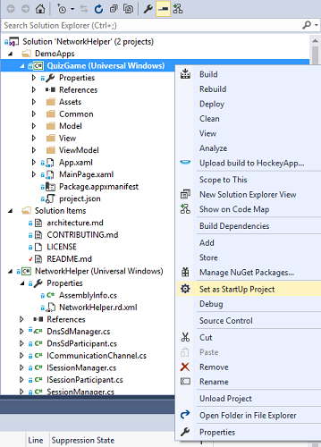
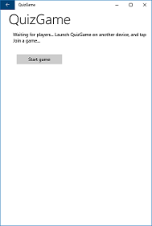
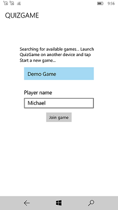
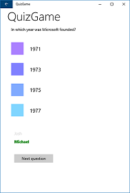
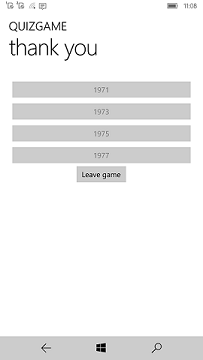

<!---
  category: NetworkingAndWebServices Data
-->

# NetworkHelper sample library

A sample library and demo mini-app that shows how to use UWP networking APIs to enable network discovery and communication in your games or apps. 
This sample runs on the Universal Windows Platform (UWP). 

Specifically, the library provides the ability for:

- Wi-Fi network discovery and management peer clients over a local Wi-Fi network.
- Direct communication between discovered devices on the same Wi-Fi network with developer configurable messages.

## Running the sample
To run the sample, you need the latest version of Windows 10 installed on your target and development machines. For more information about Windows 10 see the [Windows 10 Upgrade](https://go.microsoft.com/fwlink/p/?LinkId=619312) page.

You will also need the latest version of Visual Studio and the Windows Software Development Kit (SDK) for Windows 10. You can get a free copy of these tools by visiting the [Downloads and tools for Windows 10](http://go.microsoft.com/fwlink/?LinkID=280676) page.

After you have the latest version of Windows 10 and development tools installed on your machine, you are ready to run the sample in Visual Studio. To do this you need to set the StartUp Project to one of the Demo Apps in the DemoApps folder in Visual Studio. Below are instructions for setting QuizGame as the start up project.

1. Open the NetworkHelper solution in Visual Studio
2. In the Solution Explorer, right-click the QuizGame project, then select *Set as StartUp Project*.

3. You can now deploy to two different devices and Start Debugging (F5) or Start Without Debugging (Ctrl+F5) to try the sample out.

**Important Note** This sample is supposed to run on two separate devices on the same local network. To get a full experience, deploy this sample to more than one device and make sure they are on the same Wi-Fi network. If you are running into any issues running this sample, make sure that you have started QuizGame on another device and started a new game. If this doesn't work, ensure that your Wi-Fi router or local network system allows UDP multicast packets to be sent and received. Some networks do not allow network discovery by blocking UDP multicast packets.

## Demo App

**QuizGame** is a Universal Windows Platform (UWP) app sample that uses the NetworkHelper library to enable a pub-style trivia game. When running the sample, you are presented with an option to create a new game as a quiz master on your local network or join an existing game and answer questions from the quiz master. Questions appear on the quiz master's screen while players answer the questions on their own devices. A quiz master can advance the game to additional questions and display the scores at the end. Below are some features that QuizGame uses.
- Simple MVVM (Model, View, ViewModel) coding pattern
- Simple navigation using code-behind files.
- NetworkHelper to enable discovery and broadcasting of available games on the local network.
- NetworkHelper to enable communication between the game and players.

## Code at a glance

If you’re just interested in code snippets for certain API and don’t want to browse or run the full sample, check out the following files for examples of some highlighted features:

Below are the details of the NetworkHelper library interface.
* [ICommunicationChannel.cs](NetworkHelper/ICommunicationChannel.cs#L33), [ISessionManager.cs](NetworkHelper/ISessionManager.cs#L33), [ISessionParticipant.cs](NetworkHelper/ISessionParticipant.cs#L33), [SessionManager.cs](NetworkHelper/SessionManager.cs#L33), and [SessionParticipant.cs](NetworkHelper/SessionParticipant.cs#L33):
    - These interfaces represent a generic peer-to-peer helper architecture that provides the framework for implementing various network protocols.
    - The ISessionManager interface and SessionManager abstract class define how a specific protocol can advertise itself to listening participants, manage connected participants, and provide direct communication to connected participants.
    - The ISessionParticipant interface and SessionParticipant abstract class define how a specific protocol can listen for managers, establish a connection to a manager, and communicate directly with managers.
    - The ICommunicationChannel interface defines how message are sent and received between managers and participants.

Below are the details of the TCP/UDP and DNS-SD implementations of the NetworkHelper library interface.
* [TcpCommunicationChannel.cs](NetworkHelper/TcpCommunicationChannel.cs#L35), [UdpManager.cs](NetworkHelper/UdpManager.cs#L37),  [UdpParticipant.cs](NetworkHelper/UdpParticipant.cs#L37), [DnsSdManager.cs](NetworkHelper/DnssdManager.cs#L36), and [DnsSdParticipant.cs](NetworkHelper/DnssdParticipant.cs#L35):
    - These classes are a concrete implementation of the interfaces and abstract classes described above for the TCP/UDP network protocol.
    - The UdpManager class broadcasts UDP messages to listening participants, listens for participant connection requests, and generates TcpCommunicationChannel objects for sending messages to connected participants.
    - The DnsSdManager class registers a DNS-SD instance to listening participants, listens for participant connection requests, and generates TcpCommunicationChannel objects for sending messages to connected participants.
    - The UdpParticipant class listens for UDP messages broadcast by managers, sends UDP connection requests to managers, and generates TcpCommunicationChannel objects for sending messages to managers.
    - The DnsSdParticipant class listens for registered DNS-SD instances, sends UDP connection requests to managers, and generates TcpCommunicationChannel objects for sending messages to managers.
    - The TcpCommunicationChannel class listens for TCP connections and sends TCP messages.
    - You can use the NetworkHelper library as-is in your projects, either directly, or through an adapter to keep it decoupled. (See the Communicator types below for an example of an adapter.)
