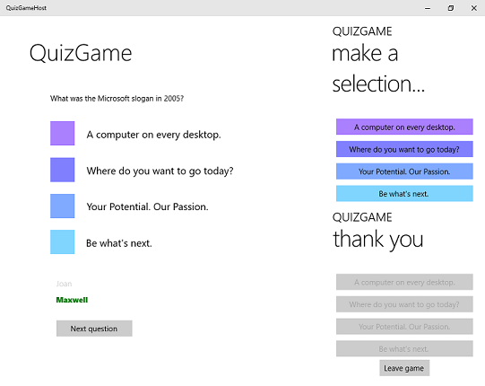

# QuizGame sample

**QuizGame** is a Universal Windows Platform (UWP) app sample that explores the benefits of running the same app on multiple devices in direct communication with one-another.

The UWP enables apps to run on a wide variety of devices and adapt to the available capabilities. Apps that use networking capabilities can put these devices in simultaneous contact to create the effect of a single app instance spanning several devices at once.

QuizGame implements this scenario to enable a pub-style trivia game. Questions appear on a large screen while members of the audience answer the questions on their phones and tablets. A quiz master can advance the game to additional questions and display the score at the end.

## Features

**Note:** Features in this app are subject to change.

QuizGame demonstrates:

* Peer-to-peer communication using UDP multicast and TCP; see the [P2PHelper](P2PHelper) project.
* A UWP app targeting the Universal device family and therefore capable of running on large and small screens.
* C# and XAML using the MVVM design pattern. For more info, see the [architecture notes](architecture.md).

## Universal Windows Platform development

This sample requires Visual Studio 2015 and the Windows Software Development Kit (SDK) for Windows 10.

[Get a free copy of Visual Studio 2015 Community Edition with support for building Universal Windows apps](http://go.microsoft.com/fwlink/?LinkID=280676)

Additionally, to be informed of the latest updates to Windows and the development tools, join the [Windows Insider Program](https://insider.windows.com/ "Become a Windows Insider").

## Running the sample

The default project is QuizGameHost and you can Start Debugging (F5) or Start Without Debugging (Ctrl+F5) to try it out. The app will run in the emulator or on physical devices. When running QuizGameClient please ensure that QuizGameHost is not already running.

**Note:** The platform target currently defaults to ARM, so be sure to change that to x64 or x86 if you want to test on a non-ARM device.

QuizGameHost is in local test mode by default (the conditional compilation symbol LOCALTESTMODEON is defined in the project's build properties). To turn off local test mode you can change LOCALTESTMODEON to LOCALTESTMODEOFF.

When local test mode is off, run the client and host apps on separate devices to play the game more realistically. Be sure to set the target platform and startup project as appropriate before you deploy.

**Note:** This sample assumes your network is configured to send and receive custom UDP group multicast packets (most home networks are, although your work network may not be). The sample also sends and receives TCP packets.

## Code at a glance

If you’re just interested in code snippets for certain API and don’t want to browse or run the full sample, check out the following files for examples of some highlighted features:

* [P2PHelper project](P2PHelper) ([ICommunicationChannel.cs](P2PHelper/ICommunicationChannel.cs#L33), [ISessionManager.cs](P2PHelper/ISessionManager.cs#L33), [ISessionParticipant.cs](P2PHelper/ISessionParticipant.cs#L33), [SessionManager.cs](P2PHelper/SessionManager.cs#L33), and [SessionParticipant.cs](P2PHelper/SessionParticipant.cs#L33)):
    - These interfaces represent a generic peer-to-peer helper architecture that provides the framework for implementing various network protocols.
    - The ISessionManager interface and SessionManager abstract class define how a specific protocol can advertise itself to listening participants, manage connected participants, and provide direct communication to connected participants.
    - The ISessionParticipant interface and SessionParticipant abstract class define how a specific protocol can listen for managers, establish a connection to a manager, and communicate directly with managers.
    - The ICommunicationChannel interface defines how message are sent and received between managers and participants.
* [P2PHelper project](P2PHelper) ([TcpCommunicationChannel.cs](P2PHelper/TcpCommunicationChannel.cs#L35), [UdpManager.cs](P2PHelper/UdpManager.cs#L37),  [UdpParticipant.cs](P2PHelper/UdpParticipant.cs#L37), [DnsSdManager.cs](P2PHelper/DnsSdManager.cs#L36), and [DnsSdParticipant.cs](P2PHelper/DnsSdParticipant.cs#L35)):
    - These classes are a concrete implementation of the interfaces and abstract classes described above for the TCP/UDP network protocol.
    - The UdpManager class broadcasts UDP messages to listening participants, listens for participant connection requests, and generates TcpCommunicationChannel objects for sending messages to connected participants.
    - The DnsSdManager class registers a DNS-SD instance to listening participants, listens for participant connection requests, and generates TcpCommunicationChannel objects for sending messages to connected participants.
    - The UdpParticipant class listens for UDP messages broadcast by managers, sends UDP connection requests to managers, and generates TcpCommunicationChannel objects for sending messages to managers.
    - The DnsSdParticipant class listens for registered DNS-SD instances, sends UDP connection requests to managers, and generates TcpCommunicationChannel objects for sending messages to managers.
    - The TcpCommunicationChannel class listens for TCP connections and sends TCP messages.
    - You can use the P2PHelper library as-is in your projects, either directly, or through an adapter to keep it decoupled. (See the Communicator types below for an example of an adapter.)
* [BindableBase.cs](Common/BindableBase.cs#L37) and [DelegateCommand.cs](Common/DelegateCommand.cs#L55):
    - MVVM helper classes
    - Inherit from BindableBase to make your class observable (that is, give it an implementation of INotifyPropertyChanged)
    - Expose a property of type DelegateCommand on your class to implement the command pattern (an implementation of ICommand)
* [Game.cs](Model/Game.cs#L33):
    - The Game class and GameState enum, which implement the game engine
* [IHostCommunicator.cs](Model/IHostCommunicator.cs#L30) and [IClientCommunicator.cs](Model/IClientCommunicator.cs#L30):
    - Interfaces that define the client-host communication protocol in terms of the game domain.
* [HostCommunicator.cs](Model/HostCommunicator.cs#L37) and [ClientCommunicator.cs](Model/ClientCommunicator.cs#L33):
    - Concrete implementations of the communicator interfaces that adapt game communication concepts to the TCP/UDP P2PHelper API.  
* [ClientView.xaml](View/ClientView.xaml#L25), [HostView.xaml](View/HostView.xaml#L25), and [TestView.xaml](View/TestView.xaml#L25):
    - XAML views (visuals) for the client, host, and local test mode functionality, respectively
* [ClientView.xaml.cs](View/ClientView.xaml.cs#L30), [HostView.xaml.cs](View/HostView.xaml.cs#L30), and [TestView.xaml.cs](View/TestView.xaml.cs#L30):
    - Code-behind files supporting the XAML views
* [ClientViewModel.cs](ViewModel/ClientViewModel.cs#L35) and [HostViewModel.cs](ViewModel/HostViewModel.cs#L40):
    - View models (state and behavior) for the client and host, respectively
* [ViewModelLocator.cs](ViewModel/ViewModelLocator.cs#L32):
    - A view model locator that can be instantiated in markup and will locate (that is, instantiate if necessary and return) an appropriate view model depending on the the mode of the view (for example, being edited in a design tool, being run in test mode, or being run in retail mode)
* [QuizGameTests.cs](QuizGameTests/QuizGameTests.cs#L31):
    - Unit tests that cover the basic requirements of the game engine.
